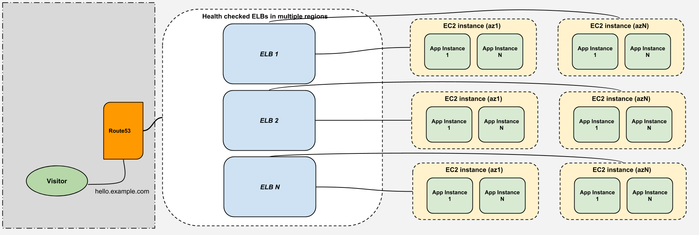

# Ansible playbooks for launching and deploying a spring app

The playbooks are designed to dynamically work with almost any spring app, the infrastructure is also built to be scalable, fault-tolerant and highly available. 

The whole setup is bound to the `AWS_DEFAULT_PROFILE`. Theory, we have a profile which could be an enviornment, an app within an environment, a region, or a combination of the three. As boto and awscli are coupled with `aws_profile` it made it more felixable to do it in this fashion. more on requirements.


#### -

--- 

#### An overview of the infrastructure design



---

### Requirements:

- packages that we need installed: `python3, ansible > 2.4 , boto, boto3, botocore, awscli`
- Define our ansible variables and profiles in ~/.aws/config and ~/.aws/credentials.

---
#### Required ansible variables with their default values:
```
app_instances: 2
app_port: 8080
haproxy_springapps_port: 8888
aws_profile: "{{ lookup('env', 'AWS_DEFAULT_PROFILE') | default('test', true) }}"
aws_region: "{{ lookup('env', 'AWS_DEFAULT_REGION') | default('us-east-1', true) }}"
aws_key_name: waheed
ansible_ssh_private_key_file: "~/.ssh/{{ aws_key_name }}"
git_key: ec2-new
app_git_url: "git@gitlab.com:waheedi/spring-time-app.git"
branch: master
create_ec2_instances: yes
instances_count: 1
az_count: 2
aws_instance_type: t2.micro
rsyslog_server: localhost
route53_zone: "saascoin.network"
hello_dns: "hello.example.com"
```
#### Optional ansible variables:

```
aws_profile_2: "{{ lookup('env', 'AWS_SECOND_PROFILE') | default('false') }}"
update_version: yes
```
---
#### Profile Configurations:

Sample ~/.aws/config 

```

[profile test-time-app]
region = us-west-1

[profile test-hello-app]
region = us-west-2

[profile prod-time-app-east]
region = us-east-1

[profile prod-time-app-west]
region = us-west-1

```
Sample ~/.aws/credentials
```
[test-time-app]
aws_access_key_id = 
aws_secret_access_key = 

```

---

#### Deploy the infrastrcture and the spring app
- Configure the AMI for the user running the deployment, `ec2,route53,sts,elasticloadbalancing,apigateway`
- We need to specify a git url for the app to clone, configure the number of app instaces for each ec2 instance in the groups_vars/all file, which has all the default values for our playbooks
- Run the full deploy: `AWS_DEFAULT_PROFILE=prod-time-app-east ansible-playbook -i hosts full_deploy.yml`, note the env variable, you can surely specify it in different ways
- During the play you will have two copy the public keys of the new instances to the git service, it will pause for two minutes, we can automate this for github or gitlab but for now its sufficient 
- deploy to another region by changing the `AWS_DEFAULT_PROFILE` to the desired profile/region. `AWS_DEFAULT_PROFILE=prod-time-app-west ansible-playbook -i hosts full_deploy.yml`
- now as we have two regions running we can use route53 to load balance/health check on two elbs that have been created, just run deploy_to_route53.yml with two env variables `AWS_DEFAULT_PROFILE=prod-time-app-west and AWS_SECOND_PROFILE=prod-time-app-east`
- Please note, the name of aws_profile cannot contain characters that are not letters, or digits or dash (-)

---
#### The full deploy
- The full deploy is the starting point to run the infrastructure and the app we select for the deployment
1. Create the aws needed services and servers, add to our route53 zone with the desired dns name for the load balancer(s) that has been created
2. Install python on the target machines (in a raw fashion)
3. Install common packages as well as nginx, haproxy to load balance app instances inside the ec2 instance
4. Deploy the App, clone it, package it, run it and test it
